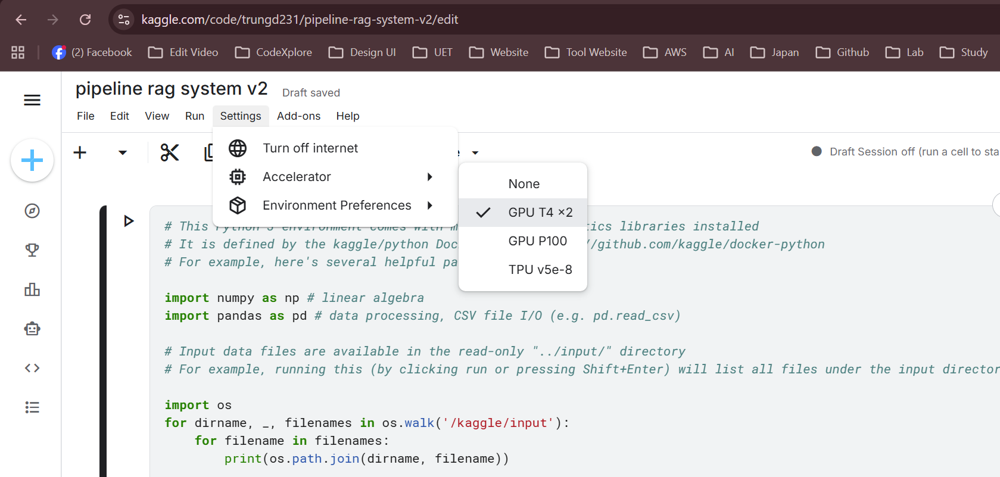
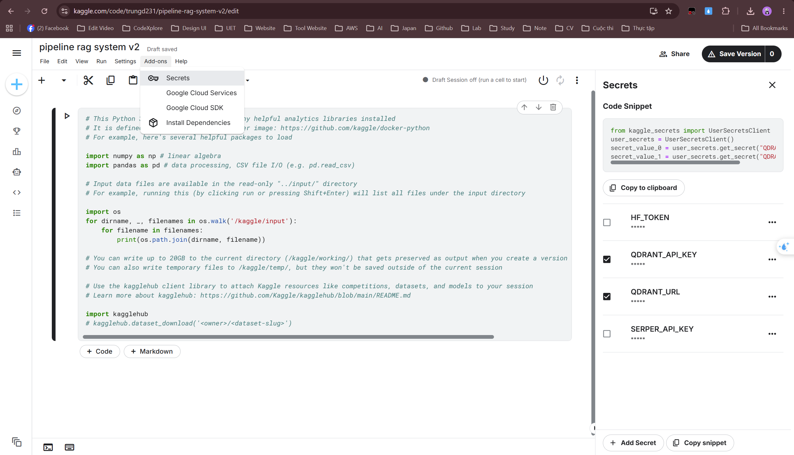
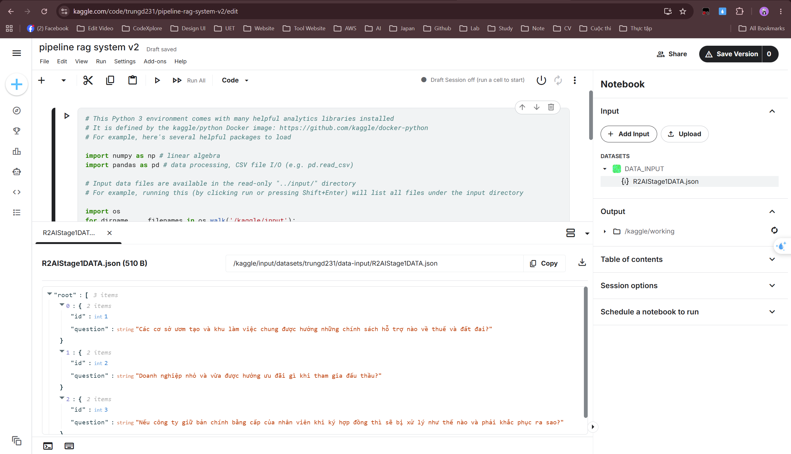
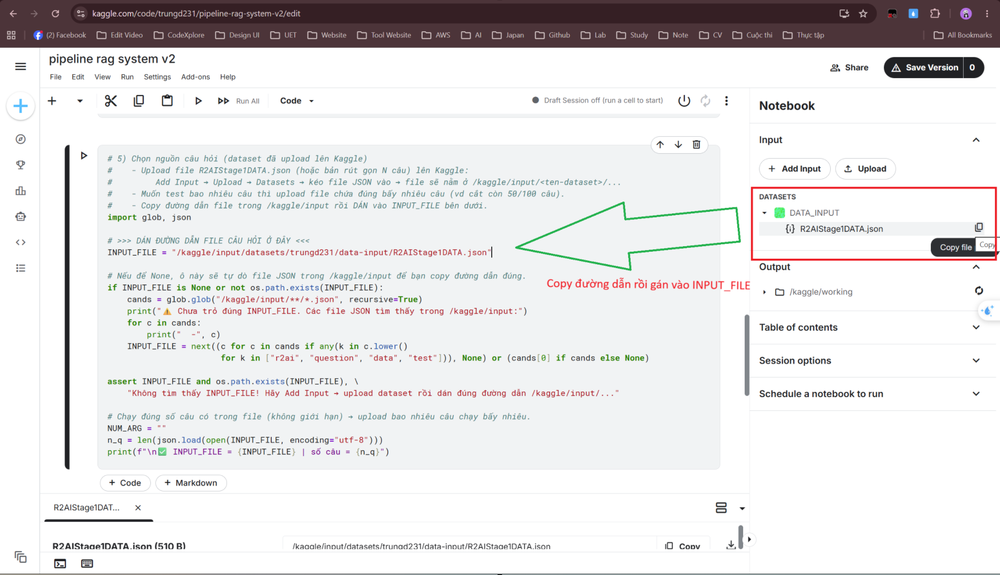
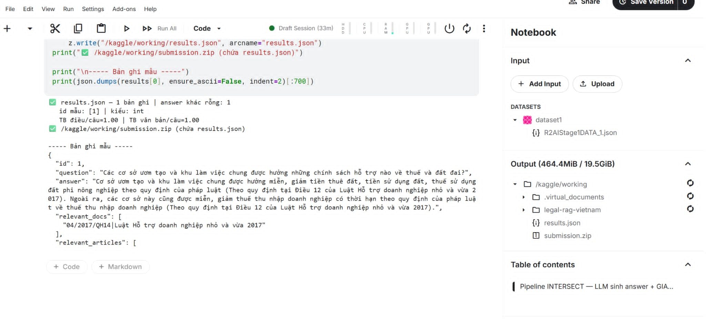

# Legal-RAG-Vietnam — Hệ thống Hỏi-Đáp Pháp lý Tiếng Việt (NEXTGEN)

Hệ thống **RAG (Retrieval-Augmented Generation)** trả lời câu hỏi pháp luật Việt Nam
(trọng tâm: pháp luật về **doanh nghiệp nhỏ và vừa – SME**). Với mỗi câu hỏi, hệ thống:
**truy hồi** điều luật liên quan → **rerank** → **LLM sinh câu trả lời** →
**giao trích dẫn (intersect)** giữa câu trả lời và pool rerank → đóng gói theo định dạng nộp bài.

Pipeline chính đang vận hành: **INTERSECT** (`fast_retrieval.py --llm-answer`).

---

## 1. Kiến trúc tổng quan

```
Câu hỏi
  │
  ├─(1) Hybrid Retrieval ── Dense (Qdrant + Vietnamese_Embedding) ┐
  │                         Sparse (BM25 + underthesea)           ├─ RRF merge → top-K thô
  │                                                               ┘
  ├─(2) Rerank ──────────── BAAI/bge-reranker-large → pool top-K (--pool-k)
  │
  ├─(3) LLM sinh answer ─── Qwen/Qwen2.5-7B-Instruct (4-bit) → câu trả lời tiếng Việt
  │
  ├─(4) Intersect citation ─ giao "Điều X" trong answer ∩ pool rerank (--max-select)
  │
  └─(5) Đóng gói ────────── results.json → submission.zip (đúng định dạng BTC)
```

Chi tiết mô hình & phiên bản checkpoint: xem [`docs/MODELS.md`](docs/MODELS.md).

---

## 2. Yêu cầu môi trường

| Thành phần | Phiên bản / yêu cầu |
|------------|---------------------|
| Python | 3.10 – 3.11 |
| GPU | ≥ 16GB VRAM (Kaggle T4 16GB / P100 16GB) — bắt buộc để nạp LLM 4-bit |
| CUDA / PyTorch | torch ≥ 2.2 (Kaggle có sẵn; local cài riêng theo CUDA của máy) |
| Đĩa trống | ~20GB (cache checkpoint HuggingFace ~18GB + dữ liệu) |
| Mạng | Cần Internet: tải checkpoint HuggingFace + kết nối Qdrant Cloud |

**Thư viện chính** (đầy đủ trong [`requirements.txt`](requirements.txt)):
`qdrant-client`, `rank_bm25`, `sentence-transformers`, `underthesea`,
`transformers`, `accelerate`, `bitsandbytes`, `python-dotenv`, `tqdm`, `numpy`.

---

## 3. Mô hình & Checkpoint sử dụng

Hệ thống dùng **3 checkpoint pretrained công khai** (KHÔNG fine-tune) + **1 vector index tự tạo**:

| Vai trò | HuggingFace ID | Phiên bản (commit SHA) |
|---------|----------------|------------------------|
| Embedding (1024-dim) | `AITeamVN/Vietnamese_Embedding` | `dea33aa1ab339f38d66ae0a40e6c40e0a9249568` |
| Reranker | `BAAI/bge-reranker-large` | `55611d7bca2a7133960a6d3b71e083071bbfc312` |
| LLM (4-bit NF4) | `Qwen/Qwen2.5-7B-Instruct` | `a09a35458c702b33eeacc393d103063234e8bc28` |
| Vector index | Qdrant Cloud collection `law_2026` | (chia sẻ qua link Drive/OneDrive) |

> Checkpoint **tự động tải** ở lần chạy đầu. Hướng dẫn pin chính xác phiên bản & tải thủ công: [`docs/MODELS.md`](docs/MODELS.md).

---

## 4. Dữ liệu

| File | Mô tả | Dung lượng |
|------|-------|-----------|
| `data/law_corpus_clean.json` | ~30k đoạn văn bản pháp lý đã chunk (`{id, text, metadata}`) — corpus cho BM25 & nguồn rerank | ~75 MB |
| `data/law_manifest.json` | Map số hiệu văn bản → metadata chuẩn BTC (dùng cho self-verify & chuẩn hóa output) | ~252 KB |
| `data/bm25_corpus.pkl` | Index BM25 đã token hóa sẵn (tự sinh từ `law_corpus_clean.json` nếu chưa có) | sinh khi chạy |
| `data/R2AIStage1DATA.json` | Bộ câu hỏi chính thức (2000 câu) | ~520 KB |

**Định dạng câu hỏi đầu vào** (JSON list):
```json
[ { "id": "1", "question": "Doanh nghiệp nhỏ và vừa được hỗ trợ gì về thuế?" } ]
```

**Vector index Qdrant:** Bản gốc nằm trên Qdrant Cloud (collection `law_2026`, 1024-dim).
Nếu giám khảo không có quyền truy cập Qdrant của đội, có thể tái dựng từ `law_corpus_clean.json`
(BM25 chạy local; dense cần một Qdrant instance — xem mục 8).

> **Link chia sẻ dữ liệu/checkpoint snapshot (Google Drive):**
> [NEXTGEN-legal-rag-data](https://drive.google.com/drive/folders/1mDoUfFrl8k3HNN6xlKsZpGdklU_A0Ifk?usp=sharing)
> (chứa `law_corpus_clean.json`, `law_manifest.json`, `R2AIStage1DATA.json` và snapshot Qdrant `law_2026`).

---

## 5. Cài đặt

```bash
# 1) Lấy mã nguồn
git clone https://github.com/kimmttrung/legal-rag-vietnam.git
cd legal-rag-vietnam

# 2) Tạo môi trường ảo
python -m venv venv
source venv/bin/activate        # Windows: venv\Scripts\activate

# 3) Cài dependencies
pip install -r requirements.txt
# Local: cài torch khớp CUDA của máy, ví dụ:
# pip install torch --index-url https://download.pytorch.org/whl/cu121
```

---

## 6. Cấu hình (biến môi trường)

Tạo file `.env` ở thư mục gốc:
```ini
QDRANT_URL=https://<your-cluster>.qdrant.io
QDRANT_API_KEY=<your-api-key>
```
- Local: nạp tự động qua `python-dotenv`.
- Trên Kaggle: nạp qua `kaggle_secrets.UserSecretsClient` (xem cell 2 của notebook).

Mọi tham số khác (top-K, ngưỡng rerank, model ID, tham số LLM…) nằm trong
[`config/settings.py`](config/settings.py) — sửa trực tiếp tại đây.

---

## 7. Chạy lại sản phẩm (tái hiện kết quả nộp)

### 7.1. Cách A — Chạy trên Kaggle (đúng môi trường đã nộp, khuyến nghị)

Mở [`pipeline-intersect.ipynb`](pipeline-intersect.ipynb) trên Kaggle (Accelerator = GPU T4×2/P100).

**Bước 1 — Tạo Notebook & bật GPU**
- Vào [kaggle.com](https://www.kaggle.com) → **Create → New Notebook** → Import notebook `pipeline-intersect.ipynb`.
- Bên phải, mục **Settings → Accelerator** chọn **GPU T4 ×2**



**Bước 2 — Khai báo secrets Qdrant**
- Menu **Add-ons → Secrets**, thêm 2 secret: `QDRANT_URL` và `QDRANT_API_KEY`.



**Bước 3 — Upload dataset câu hỏi**
- Bên phải, **Add Input → Upload → New Dataset**, kéo file `R2AIStage1DATA.json` vào và tạo dataset.
- ⚠️ **Muốn test bao nhiêu câu thì upload đúng bấy nhiêu câu**: cắt `R2AIStage1DATA.json` còn N câu đầu
  (vd 50/100 câu) rồi upload file rút gọn đó. Pipeline sẽ chạy đúng số câu trong file.
- Sau khi upload, file nằm tại đường dẫn dạng `/kaggle/input/<ten-dataset>/R2AIStage1DATA.json`.



**Bước 4 — Copy đường dẫn input vào ô số 5 (`INPUT_FILE`)**
- Trong panel **Input** bên phải, bấm vào file vừa upload → **Copy file path**.
- Mở **cell số 5** của notebook, **dán đường dẫn vừa copy** vào biến `INPUT_FILE`:
  ```python
  INPUT_FILE = "/kaggle/input/r2aistage1data/R2AIStage1DATA.json"   # ← dán đường dẫn của bạn
  ```
- Nếu để trống/sai đường dẫn, cell 5 sẽ tự liệt kê các file JSON trong `/kaggle/input` để bạn copy lại cho đúng.



**Bước 5 — Run All**
- **Run All**. Notebook sẽ lần lượt: cài dependencies → nạp secrets → clone mã nguồn →
  kiểm tra file → đọc `INPUT_FILE` → chạy pipeline INTERSECT → đóng gói `submission.zip`.
- File kết quả: `/kaggle/working/results.json` và `/kaggle/working/submission.zip`.



> 📷 Thư mục ảnh hướng dẫn đặt tại `docs/images/`. Thay các ảnh `01_*.png … 05_*.png` bằng ảnh chụp màn hình thực tế của bạn.

### 7.2. Cách B — Chạy bằng dòng lệnh (local / server có GPU)

**Chạy đầy đủ 2000 câu để tạo bài nộp:**
```bash
python fast_retrieval.py \
    --input data/R2AIStage1DATA.json \
    --output output/results.json \
    --llm-answer --pool-k 8 --max-select 5
```

**Chạy thử nhanh 50 câu** (lấy 50 câu đầu từ file 2000 câu):
```bash
python fast_retrieval.py \
    --input data/R2AIStage1DATA.json \
    --output output/results_50.json \
    --llm-answer --pool-k 8 --max-select 5 --num-questions 50
```

**Tham số chính của `fast_retrieval.py`:**
| Cờ | Ý nghĩa |
|----|---------|
| `--input` | File câu hỏi JSON (bắt buộc) |
| `--output` | Đường dẫn xuất `results.json` |
| `--llm-answer` | Bật chế độ INTERSECT: LLM sinh answer + giao trích dẫn (chế độ nộp chính) |
| `--pool-k` | Số ứng viên rerank đưa vào pool giao trích dẫn (mặc định 8) |
| `--max-select` | Số Điều tối đa giữ lại mỗi câu (mặc định 5) |
| `--num-questions` | Giới hạn số câu (0 = tất cả) |
| `--flush-every` | Ghi tạm `results.json` sau mỗi N câu (chống mất dữ liệu khi crash) |

### 7.3. Đóng gói bài nộp
```bash
cd output && zip submission.zip results.json
```
File `results.json` gồm đúng **2000 bản ghi**, mỗi bản ghi:
```json
{
  "id": "1",
  "question": "...",
  "answer": "Theo quy định tại Điều ... ",
  "relevant_docs": ["67/2014/QH13|Luật Đầu tư"],
  "relevant_articles": ["67/2014/QH13|Luật Đầu tư|Điều 5"]
}
```

---

## 8. (Tùy chọn) Tái dựng dữ liệu từ đầu

```bash
# Export lại corpus từ Qdrant Cloud (cần .env hợp lệ) → data/law_corpus_clean.json
python export_corpus.py

# Dựng lại BM25 index → data/bm25_corpus.pkl
python -m src.index_bm25
```
> Phần **dense index** (Qdrant) được dựng sẵn từ trước bằng model embedding ở mục 3.
> Để dựng lại hoàn toàn dense index trên một Qdrant mới, cần re-embed `law_corpus_clean.json`
> bằng `AITeamVN/Vietnamese_Embedding` và upsert vào collection `law_2026` (1024-dim, distance Cosine).

---

## 9. Cấu trúc thư mục

```
legal-rag-vietnam/
├── fast_retrieval.py        # Pipeline INTERSECT (điểm chạy chính khi nộp)
├── main.py                  # Pipeline đầy đủ (retrieve→rerank→generate→self-verify→package)
├── export_corpus.py         # Export corpus từ Qdrant Cloud → data/law_corpus_clean.json
├── pipeline-intersect.ipynb # Notebook Kaggle chạy pipeline INTERSECT
├── requirements.txt         # Danh sách dependencies
├── config/
│   └── settings.py          # Toàn bộ tham số cấu hình + model ID
├── src/
│   ├── hybrid_retriever.py  # Hybrid retrieval (dense + sparse + RRF)
│   ├── index_bm25.py        # Xây/nạp BM25 index
│   ├── reranker.py          # Cross-encoder reranker
│   ├── answer_generator.py  # Nạp & chạy LLM 4-bit sinh answer
│   ├── answer_intersect.py  # Giao trích dẫn answer ∩ pool rerank
│   ├── llm_selector.py      # Chế độ LLM-select (thay thế)
│   ├── self_verifier.py     # Chống ảo giác (5 rule)
│   ├── post_processor.py    # Trích & chuẩn hóa relevant_docs/articles
│   └── evaluator.py         # Thống kê nội bộ
├── data/                    # Corpus, manifest, bộ câu hỏi
└── docs/
    └── MODELS.md            # Mô hình & phiên bản checkpoint
```

---

## 10. Xử lý sự cố thường gặp

| Triệu chứng | Nguyên nhân / cách xử lý |
|-------------|--------------------------|
| `CUDA out of memory` khi nạp LLM | Cần GPU ≥16GB. Đảm bảo nạp 4-bit (bitsandbytes đã cài), giảm `MAX_CONTEXT_CHARS` trong `settings.py`. |
| Kết nối Qdrant lỗi / rỗng | Kiểm tra `QDRANT_URL`, `QDRANT_API_KEY` trong `.env`; xác nhận collection `law_2026` tồn tại. |
| Tải checkpoint chậm/lỗi | Lần đầu cần Internet; có thể tải trước bằng `huggingface-cli` (xem `docs/MODELS.md`). |
| `bitsandbytes` lỗi trên Windows | Khuyến nghị chạy trên Kaggle/Linux; Windows cần bản `bitsandbytes` hỗ trợ CUDA tương ứng. |
| BM25 index không có | Tự sinh từ `law_corpus_clean.json` ở lần chạy đầu; hoặc chạy `python -m src.index_bm25`. |
